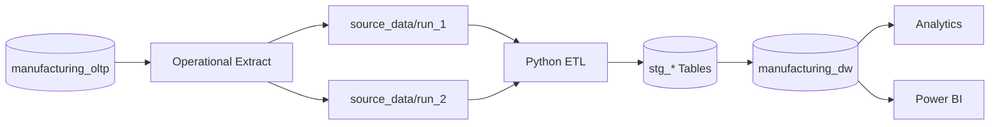
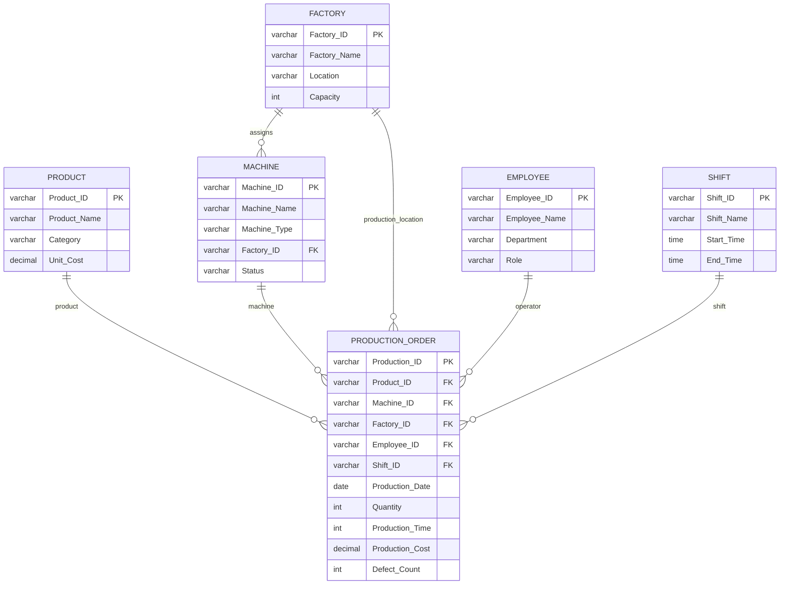
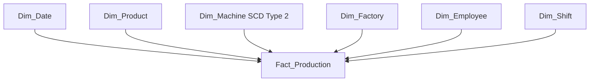
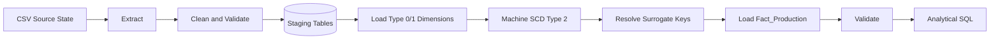
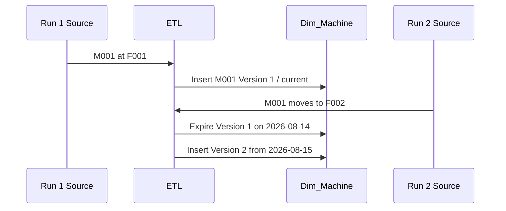

# Enterprise Manufacturing Data Warehouse

[](https://github.com/akindaG/Enterprise-Manufacturing-Data-Warehouse/actions/workflows/milestone5-etl-demo.yml)

An end-to-end **CCS3307 Data Warehousing** implementation for **Enterprise Manufacturing Production Operations Analytics**. The repository covers business requirements, operational source design, dimensional modelling, staging, ETL, surrogate keys, Slowly Changing Dimension Type 2, two changed source states, incremental fact loading, historical validation and analytical SQL.

**Author:** Akinda Gunarathne

> Core Data Warehouse implementation: complete. Final visual submission artifacts still to be authored/captured: Power BI `.pbix`, real screenshots, final PDF/presentation and ZIP package.

---

## Project at a Glance

| Item | Design |
|---|---|
| Business domain | Manufacturing Industry |
| Selected business process | Production Operations Analytics |
| Dimensional approach | Kimball-style Star Schema |
| Fact table | `Fact_Production` |
| Grain | one completed production event |
| Dimensions | Date, Product, Machine, Factory, Employee, Shift |
| Historical strategy | `Dim_Machine` . SCD Type 2 |
| ETL | Python + Pandas + SQLAlchemy |
| Warehouse | PostgreSQL |
| Automated validation | GitHub Actions |
| Analytics | SQL + Power BI implementation specification |

---

# Business Problem

Manufacturing operational systems are optimised for recording current activity. Management, however, needs historical and multidimensional answers such as:

- How is production changing over time?
- Which factory has the highest output or lowest defect rate?
- Which products contribute the most volume and cost?
- Which machines are most efficient?
- Which shifts have the strongest quality performance?
- What was a machine's assignment when a historical production event occurred?

The warehouse converts operational production records into a stable analytical model while preserving relevant history.

---

# Source Architecture

The logical business source is the normalized PostgreSQL database `manufacturing_oltp`. For reproducibility, the two required ETL executions use CSV snapshots of the relevant operational entities.



The CSV folders are source-state extracts for the academic demonstration, not six unrelated operational systems.

---

# OLTP Source Database



In this synthetic operational model, `Production_Order` represents a completed production execution event.

---

# Dimensional Model

## Fact Grain

One `Fact_Production` row represents **one completed production event for one product, produced by one machine, handled by one employee, during one shift, at one factory, on one production date**.

`Production_ID` is retained as a degenerate dimension/source transaction identifier so the ETL can trace and safely de-duplicate incremental facts.

## Star Schema



## Measures

| Measure | Additivity | Purpose |
|---|---|---|
| `Quantity_Produced` | Additive | production volume |
| `Production_Cost` | Additive | manufacturing cost |
| `Production_Time` | Additive across disjoint events | production minutes |
| `Defect_Count` | Additive | defective units |

Generated analytical measures:

- `Good_Quantity = Quantity_Produced - Defect_Count`
- `Defect_Rate = SUM(Defect_Count) / SUM(Quantity_Produced) * 100`
- `Cost_Per_Unit = SUM(Production_Cost) / SUM(Quantity_Produced)`

---

# ETL Pipeline



The ETL validates required columns, null/duplicate business keys, numeric values, production dates, source referential integrity, machine/factory consistency and the rule `Defect_Count <= Quantity`.

---

# SCD Type 2 Demonstration

`Dim_Machine` preserves changes to machine name, type, assigned factory and status.



Two source states deliberately demonstrate all required conditions:

| Entity | Run 1 | Run 2 | Behaviour |
|---|---|---|---|
| M001 | F001 | F002 | changed . new SCD surrogate key |
| M002 | F002 | F002 | unchanged . existing version retained |
| M003 | absent | F001 | new . inserted |
| Production facts | PR001, PR002 | PR003, PR004 | incremental load |

Historical fact lookup is date-aware. PR001 keeps the original M001/F001 `Machine_Key`; PR003 uses the later M001/F002 version.

---

# Demonstration Results

After both ETL executions the controlled dataset produces:

| KPI | Result |
|---|---:|
| Production events | 4 |
| Total units | 385 |
| Total defects | 7 |
| Good units | 378 |
| Defect rate | 1.82% |
| Total production cost | 85,000.00 |
| Cost per unit | 220.78 |
| Total production minutes | 425 |

Detailed results: [`documentation/analytical_results.md`](documentation/analytical_results.md)

---

# Automated Verification and Evidence

GitHub Actions automatically:

1. provisions PostgreSQL 16
2. compiles all ETL Python modules
3. creates the star schema
4. executes Run 1
5. executes Run 2
6. verifies changed/new/unchanged SCD behaviour
7. verifies four unique production facts
8. verifies historical M001 surrogate-key resolution
9. executes analytical SQL
10. uploads a reproducible evidence artifact

The workflow artifact `milestone5-etl-evidence` contains:

- `etl_run_log.csv`
- `dim_machine_history.csv`
- `fact_history.csv`
- `analytical_results.txt`

---

# Visual Evidence Gallery

The architecture, OLTP, star-schema, ETL and SCD diagrams above render directly from version-controlled Mermaid definitions.

Real execution/dashboard screenshots must come from actual executions and the authored Power BI file. Their required filenames are defined in [`submission/evidence/README.md`](submission/evidence/README.md).

| Evidence | Status |
|---|---|
| Architecture diagram | ✅ Rendered above |
| OLTP ER diagram | ✅ Rendered above |
| Star schema | ✅ Rendered above |
| ETL flow | ✅ Rendered above |
| SCD Type 2 flow | ✅ Rendered above |
| CI execution evidence | ✅ Generated by GitHub Actions artifact |
| Run 1 / Run 2 screenshots | ⏳ capture from real execution |
| SCD history screenshot | ⏳ capture from real warehouse |
| Power BI screenshots | ⏳ capture after `.pbix` is authored |

<!-- After real evidence is committed, embed it here, for example:


-->

---

# Technology Stack

| Technology | Role |
|---|---|
| PostgreSQL 16 | OLTP model and dimensional Data Warehouse |
| Python 3.12 | ETL orchestration |
| Pandas | source extraction/cleaning/staging preparation |
| SQLAlchemy | transactional database access |
| psycopg2 | PostgreSQL driver |
| python-dotenv | safe local environment configuration |
| SQL | DDL, validation and analytics |
| GitHub Actions | reproducibility, automated testing and evidence |
| Power BI | final interactive dashboard target; `.pbix` pending final authoring |

---

# Repository Structure

```text
.github/workflows/       Automated two-run ETL validation and evidence
analytics/               KPI, analytical and SCD verification SQL
documentation/           Requirements, rationale, modelling and audit documents
etl_pipeline/            Python ETL implementation and supporting helpers
oltp_database/           Source schema, relationships and sample operational data
powerbi_dashboard/       Power BI model specification and DAX measures
source_data/run_1/       First operational source state
source_data/run_2/       Changed operational source state
submission/              Final report, architecture and evidence structure
warehouse_database/      Dimension, fact and relationship DDL
.env.example             Safe local configuration template
requirements.txt         Python dependencies
README.md                Project overview and reproduction guide
```

---

# Local Setup and Reproduction

## 1. Clone and install dependencies

```bash
git clone https://github.com/akindaG/Enterprise-Manufacturing-Data-Warehouse.git
cd Enterprise-Manufacturing-Data-Warehouse
python -m venv .venv
source .venv/bin/activate   # Windows: .venv\Scripts\activate
pip install -r requirements.txt
```

## 2. Configure the connection

Copy `.env.example` to `.env` and edit values when required:

```bash
cp .env.example .env
```

`DATABASE_URL` can also be supplied directly. Never commit real credentials.

## 3. Create the optional OLTP source database

```bash
psql -U postgres -c "CREATE DATABASE manufacturing_oltp;"
psql -U postgres -d manufacturing_oltp -f oltp_database/schema.sql
psql -U postgres -d manufacturing_oltp -f oltp_database/relationships.sql
psql -U postgres -d manufacturing_oltp -f oltp_database/sample_data.sql
```

The ETL demonstration itself reads the reproducible CSV extracts in `source_data/`.

## 4. Create the Data Warehouse

```bash
psql -U postgres -c "CREATE DATABASE manufacturing_dw;"
psql -U postgres -d manufacturing_dw -f warehouse_database/dimension_tables.sql
psql -U postgres -d manufacturing_dw -f warehouse_database/fact_tables.sql
psql -U postgres -d manufacturing_dw -f warehouse_database/warehouse_schema.sql
```

## 5. Execute Run 1

```bash
python etl_pipeline/run_etl.py --source-dir source_data/run_1 --run-date 2026-08-01
```

## 6. Execute Run 2

```bash
python etl_pipeline/run_etl.py --source-dir source_data/run_2 --run-date 2026-08-15
```

## 7. Validate SCD and historical keys

```bash
psql -U postgres -d manufacturing_dw -f analytics/scd_verification.sql
```

## 8. Execute analytical queries

```bash
psql -U postgres -d manufacturing_dw -f analytics/production_kpi_analysis.sql
```

---

# CCS3307 Requirement Coverage

| Requirement | Status |
|---|---|
| Business domain and one selected process | ✅ |
| Source identification and rationale | ✅ |
| OLTP design, keys and relationships | ✅ |
| One Fact Table | ✅ |
| Explicit fact grain | ✅ |
| Source measures and additivity | ✅ |
| Generated/calculated measures | ✅ |
| Dimension identification and attributes | ✅ |
| Surrogate keys | ✅ |
| SCD strategy and rationale | ✅ |
| SCD Type 2 historical implementation | ✅ |
| Staging layer | ✅ |
| Dimension-first ETL | ✅ |
| Fact surrogate-key lookup | ✅ |
| Two source states / two ETL executions | ✅ |
| New, changed and unchanged records | ✅ |
| Incremental fact loading | ✅ |
| Analytical queries and documented results | ✅ |
| Architecture documentation | ✅ |
| Testing and validation | ✅ |
| Detailed report draft | ✅ |
| Actual Power BI `.pbix` | ⏳ final manual authoring |
| Real screenshots and final PDF/ZIP | ⏳ final submission stage |

Full mapping: [`documentation/lecturer_alignment_checklist.md`](documentation/lecturer_alignment_checklist.md)

Repository audit: [`documentation/repository_audit.md`](documentation/repository_audit.md)

---

# Power BI

The intended dashboard model, pages and implementation instructions are in [`powerbi_dashboard/README.md`](powerbi_dashboard/README.md), with reusable measures in [`powerbi_dashboard/measures.dax`](powerbi_dashboard/measures.dax).

The final `.pbix` must be created from the real PostgreSQL warehouse rather than fabricated as a placeholder.

---

# Submission

The final-report draft follows the lecturer's requested report structure in [`submission/Final_Report.md`](submission/Final_Report.md). Architecture documentation and the real-evidence checklist are also under `submission/`.

## Current final-stage tasks

- author and commit the actual Power BI `.pbix`
- capture real Run 1, Run 2, SCD and analytical screenshots
- capture Power BI dashboard screenshots
- insert evidence into the final report
- export the reviewed report as PDF
- create presentation and final ZIP

---

## Author

**Akinda Gunarathne**  
CCS3307 Data Warehousing Project
