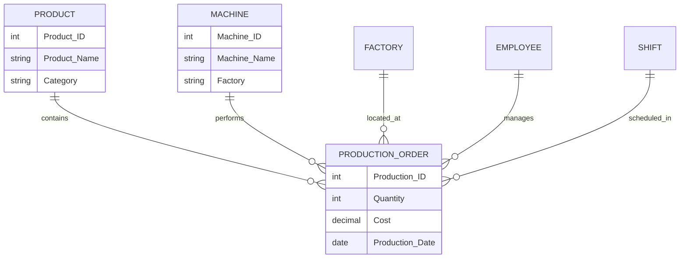
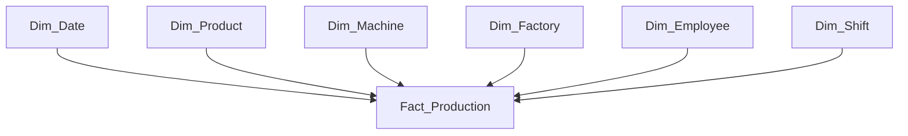
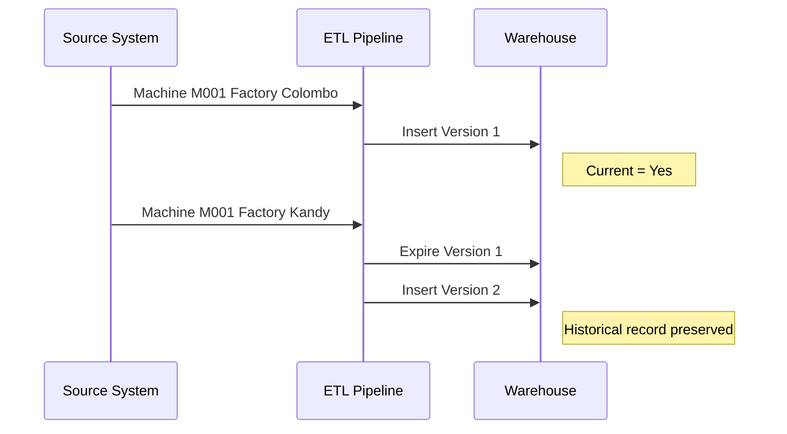

# Enterprise Manufacturing Data Warehouse

[](https://github.com/akindaG/Enterprise-Manufacturing-Data-Warehouse/actions/workflows/milestone5-etl-demo.yml)

A complete **Data Warehouse implementation for CCS3307 Data Warehousing** demonstrating the full lifecycle of a manufacturing analytics solution.

The project combines academic Data Warehousing principles with industry-style practices including ETL automation, dimensional modelling, Slowly Changing Dimensions, historical analysis, analytical SQL, and dashboard preparation.

---

# Project Overview

## Business Domain

**Enterprise Manufacturing Analytics**

Manufacturing organisations generate operational data from production activities, machines, factories, employees, products, and shifts. Direct operational systems make historical analysis and business intelligence difficult.

This Data Warehouse provides a centralized analytical platform for production performance analysis.

---

# Selected Business Process

## Production Operations Analytics

The selected business process is **manufacturing production operations**.

Each production event records:

- Product produced
- Machine used
- Factory location
- Employee responsible
- Production shift
- Quantity produced
- Production cost
- Production duration
- Defect information

---

# Enterprise Data Warehouse Architecture


## Architecture Flow

```text
Source Systems
      ↓
Staging Layer
      ↓
Validation & Transformation
      ↓
Dimension Loading
      ↓
SCD Type 2 Processing
      ↓
Fact Production Loading
      ↓
Analytics / Reporting
      ↓
Power BI Dashboard
```

---

# OLTP Source Database Design

The operational source system contains manufacturing transaction data.



---

# Dimensional Model

## Star Schema



## Fact Table

`Fact_Production`

### Grain

One row represents one completed production event for one product, produced by one machine, handled by one employee, during one shift, at one factory, on one production date.

## Dimensions

| Dimension | Purpose |
|---|---|
| Dim_Date | Time-based analysis |
| Dim_Product | Product performance |
| Dim_Machine | Machine analysis and history |
| Dim_Factory | Factory comparison |
| Dim_Employee | Workforce analysis |
| Dim_Shift | Shift performance |

## Measures

- Quantity Produced
- Production Cost
- Production Time
- Defect Count

Generated measures:

- Good Quantity
- Defect Rate
- Cost Per Unit

---

# ETL Pipeline Design


The implemented ETL pipeline performs:

1. Extract source data
2. Load staging data
3. Validate and clean records
4. Transform data
5. Load dimensions
6. Generate surrogate keys
7. Apply SCD Type 2 logic
8. Load Fact_Production
9. Validate warehouse results

---

# Slowly Changing Dimension Type 2

`Dim_Machine` implements SCD Type 2 historical tracking.



## Run 1

```text
Machine M001
Factory Colombo
Current Record = Yes
```

## Run 2

```text
Machine M001
Factory Kandy
```

Warehouse history:

```text
Previous Version
Factory Colombo
Current = No

New Version
Factory Kandy
Current = Yes
```

---

# Analytical Capabilities

The warehouse supports:

- Monthly production trends
- Factory performance comparison
- Machine efficiency analysis
- Product production ranking
- Quality analysis
- Historical machine tracking

Analytical SQL files are available in:

```text
analytics/
```

---

# Technology Stack

| Technology | Purpose |
|---|---|
| PostgreSQL | Data Warehouse database |
| Python | ETL development |
| Pandas | Data transformation |
| SQLAlchemy | Database connectivity |
| SQL | Analytical queries |
| GitHub Actions | Automated validation |
| Power BI | Dashboard visualization |

---

# Repository Structure

```text
oltp_database/          Source OLTP design
source_data/            Run 1 and Run 2 datasets
etl_pipeline/           ETL implementation
warehouse_database/     Star schema implementation
analytics/              Analytical queries
documentation/          Project documentation
.github/                CI/CD workflow
```

---

# Milestone Progress

| Milestone | Status |
|---|---|
| 1. Project Foundation | ✅ Complete |
| 2. Business Requirements and DW Design | ✅ Complete |
| 3. OLTP and Warehouse Implementation | ✅ Complete |
| 4. ETL Pipeline Development | ✅ Complete |
| 5. SCD Type 2 and Two ETL Executions | ✅ Complete |
| 6. Analytics and Dashboard Design | ✅ Complete |
| 7. Final Report and Submission Package | 🔄 In Progress |

---

# CCS3307 Requirement Coverage

✅ Manufacturing business domain  
✅ Single selected business process  
✅ Single Fact Table  
✅ Fact grain definition  
✅ Dimension modelling  
✅ Surrogate keys  
✅ Staging layer  
✅ ETL pipeline  
✅ SCD Type 2 implementation  
✅ Two pipeline executions  
✅ Historical data demonstration  
✅ Analytical queries  
✅ Business value demonstration

---

# Running the Project

```bash
pip install -r requirements.txt
```

Run ETL Run 1:

```bash
python etl_pipeline/run_etl.py --source-dir source_data/run_1 --run-date 2026-08-01
```

Run ETL Run 2:

```bash
python etl_pipeline/run_etl.py --source-dir source_data/run_2 --run-date 2026-08-15
```

---

# Final Development Stage

Completed:

- Data Warehouse design
- OLTP and warehouse implementation
- ETL pipeline
- SCD Type 2 demonstration
- Analytical SQL layer
- Dashboard design

Remaining:

- Power BI dashboard final file
- Final report
- Evidence screenshots
- Submission package

---

## Author

**Akinda Gunarathne**

CCS3307 Data Warehousing Project
