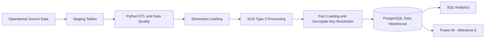

# Enterprise Manufacturing Data Warehouse

[](https://github.com/akindaG/Enterprise-Manufacturing-Data-Warehouse/actions/workflows/milestone5-etl-demo.yml)

Academic and portfolio-grade Data Warehouse implementation for **CCS3307 Data Warehousing**. The project demonstrates the complete lifecycle from business requirements and operational source data to dimensional modelling, ETL, Slowly Changing Dimensions, historical analysis and BI-ready data.

## Business Domain

**Manufacturing Industry**

### Selected Business Process

**Production Operations Analytics**

The warehouse analyses completed manufacturing production events, including production volume, production cost, production time, defects, machine performance, factory performance and shift performance.

## Architecture



Minimum implemented flow:

```text
Source Data -> Staging -> Transformation -> Dimensions -> SCD Type 2 -> Fact_Production -> Validation -> Analytics
```

## Dimensional Model

### Fact Table

`Fact_Production`

**Grain:** one row represents one completed production event for one product, produced by one machine, handled by one employee, during one shift, at one factory, on one production date.

`Production_ID` is retained in the fact table as a **degenerate dimension / source transaction identifier**. It provides traceability and guarantees idempotent incremental loading without creating a separate production-order dimension.

### Dimensions

- `Dim_Date`
- `Dim_Product`
- `Dim_Machine`
- `Dim_Factory`
- `Dim_Employee`
- `Dim_Shift`

### Core Measures

| Measure | Type | Purpose |
|---|---|---|
| `Quantity_Produced` | Additive | Production volume |
| `Production_Cost` | Additive | Manufacturing cost |
| `Production_Time` | Additive across production events | Total production minutes |
| `Defect_Count` | Additive | Defective units |

Derived analytics in the reporting layer can include `Good_Quantity`, `Defect_Rate` and `Cost_Per_Unit`.

## Slowly Changing Dimension Strategy

`Dim_Machine` uses **SCD Type 2** so machine assignment changes are historically preserved. Each changed machine receives a new surrogate key while the previous row is expired using `Effective_Date`, `Expiry_Date` and `Is_Current`.

Milestone 5 demonstrates:

```text
Run 1: M001 -> F001, M002 -> F002
Run 2: M001 -> F002 (changed), M002 -> F002 (unchanged), M003 -> F001 (new)
```

Historical facts resolve the correct `Machine_Key` using the production date.

## Technology Stack

- PostgreSQL 16
- Python 3.12
- Pandas
- SQLAlchemy
- psycopg2
- SQL
- GitHub Actions
- Power BI for the analytics dashboard milestone

## Repository Structure

```text
.github/workflows/       Automated ETL and SCD verification
analytics/               Analytical and validation SQL
documentation/           Business, modelling and milestone documentation
etl_pipeline/            Python ETL implementation and orchestrator
oltp_database/           Operational source schema and sample data
source_data/             Reproducible Run 1 and Run 2 source states
warehouse_database/      Star-schema DDL
requirements.txt         Python dependencies
README.md                Project overview and execution guide
```

## Development Roadmap

| Milestone | Deliverable | Status |
|---|---|---|
| 1 | Project foundation and repository setup | Complete |
| 2 | Business requirements and dimensional design | Complete |
| 3 | OLTP and Data Warehouse database implementation | Complete |
| 4 | ETL pipeline development | Complete |
| 5 | Two-run ETL, incremental loading and SCD Type 2 demonstration | Complete |
| 6 | Analytical SQL, Power BI dashboard and business insights | Next |
| 7 | Final report, evidence pack and portfolio polish | Planned |

## Run the Project

### 1. Install dependencies

```bash
pip install -r requirements.txt
```

### 2. Create the warehouse tables

```bash
psql -U postgres -d manufacturing_dw -f warehouse_database/dimension_tables.sql
psql -U postgres -d manufacturing_dw -f warehouse_database/fact_tables.sql
psql -U postgres -d manufacturing_dw -f warehouse_database/warehouse_schema.sql
```

### 3. Execute the first source state

```bash
python etl_pipeline/run_etl.py --source-dir source_data/run_1 --run-date 2026-08-01
```

### 4. Execute the changed source state

```bash
python etl_pipeline/run_etl.py --source-dir source_data/run_2 --run-date 2026-08-15
```

### 5. Verify SCD history and fact relationships

```bash
psql -U postgres -d manufacturing_dw -f analytics/scd_verification.sql
```

Set `DATABASE_URL` if the database connection differs from the default used by the ETL.

## Automated Quality Verification

The GitHub Actions workflow provisions PostgreSQL and automatically verifies:

- two successful ETL executions
- changed, unchanged and new dimension records
- two SCD Type 2 versions for M001
- correct old and current factory assignments
- four incrementally loaded production facts
- four unique `Production_ID` values
- historical fact-to-machine surrogate-key correctness

## Data Quality and Incremental Loading

The ETL validates required columns, source business keys, duplicate production identifiers, non-negative measures and the rule that `Defect_Count <= Quantity_Produced`. Facts are de-duplicated by `Production_ID`, making reruns safe and preserving legitimate production events even when their dimensional context and measures are identical.

## Current Focus

Milestones 1 to 5 are implemented. The next stage is **Milestone 6: analytical SQL and the Power BI dashboard**.
