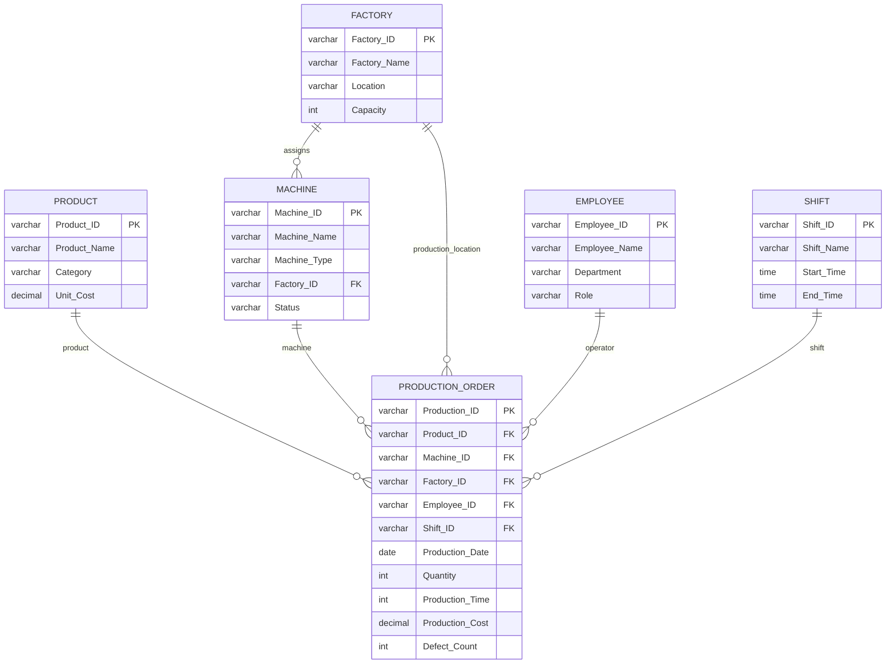

# OLTP Database Design

## Database

`manufacturing_oltp`

## Purpose

The OLTP database represents the normalized operational environment where manufacturing master data and completed production events are recorded. Only the entities required by the selected Production Operations business process are included in the warehouse project.

## Source Schema

## Table Rationale

### Product

`Product_ID` is the primary key. Product name, category and unit cost provide product master information used to build `Dim_Product`.

### Factory

`Factory_ID` is the primary key. Factory name, location and capacity provide the descriptive context for `Dim_Factory` and factory-performance analysis.

### Machine

`Machine_ID` is the primary key and `Factory_ID` references Factory. Machine name, type, assigned factory and status are relevant to equipment analysis. The warehouse preserves selected machine changes using SCD Type 2.

### Employee

`Employee_ID` is the primary key. Employee name, department and role provide workforce context for production events.

### Shift

`Shift_ID` is the primary key. Shift name and start/end times support shift-level analysis.

### Production_Order

`Production_ID` is the transaction primary key. In this synthetic operational model, the table records a **completed production execution event**, despite the operational name `Production_Order`. It references Product, Machine, Factory, Employee and Shift and records the event date plus production measures.

Measures captured are:

- `Quantity`
- `Production_Time`
- `Production_Cost`
- `Defect_Count`

## Relationship and Data-Quality Rules

- every production event must reference valid master records
- machine assignment must reference a valid factory
- quantities, costs, times and defect counts must be non-negative
- defect count cannot exceed produced quantity
- `Production_ID` uniquely identifies an operational production event

## Implementation Files

- `oltp_database/schema.sql` . creates source tables
- `oltp_database/relationships.sql` . creates foreign-key relationships
- `oltp_database/sample_data.sql` . inserts the initial Run 1 operational state

Database creation itself is performed outside `schema.sql`. This avoids the PostgreSQL problem where `CREATE DATABASE` does not automatically switch the active connection before subsequent table statements.
