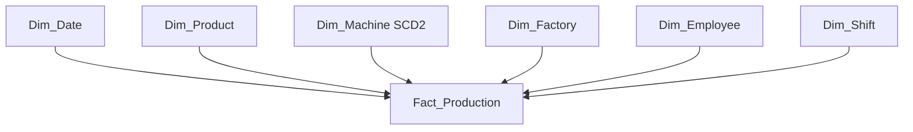

# Data Warehouse Design

## Modelling Approach

The warehouse follows a **Kimball-style dimensional modelling approach** using a star schema. The selected business process is Manufacturing Production Operations, represented by one central fact table surrounded by descriptive dimensions.

## Fact Table . Fact_Production

**Grain:** one row represents one completed production event for one product, produced by one machine, handled by one employee, during one shift, at one factory, on one production date.

Columns:

- `Production_Key` . warehouse surrogate primary key
- `Production_ID` . source transaction identifier retained as a degenerate dimension
- `Date_Key`
- `Product_Key`
- `Machine_Key`
- `Factory_Key`
- `Employee_Key`
- `Shift_Key`
- `Quantity_Produced`
- `Production_Cost`
- `Production_Time`
- `Defect_Count`

`Production_ID` is not a foreign key. It provides source traceability and a stable idempotency key for incremental ETL loading, preventing legitimate production events with identical measures from being incorrectly treated as duplicates.

## Measures and Additivity

| Measure | Source | Additivity | Analytical Purpose |
|---|---|---|---|
| `Quantity_Produced` | Production source quantity | Additive | total production volume |
| `Production_Cost` | Production source cost | Additive | total manufacturing cost |
| `Production_Time` | Production source time | Additive across disjoint events | total production minutes and average duration |
| `Defect_Count` | Production source defects | Additive | total defective units |

Generated analytical measures:

- `Good_Quantity = Quantity_Produced - Defect_Count`
- `Defect_Rate = SUM(Defect_Count) / SUM(Quantity_Produced) * 100`
- `Cost_Per_Unit = SUM(Production_Cost) / SUM(Quantity_Produced)`

`Defect_Rate` and `Cost_Per_Unit` are non-additive ratios and are recalculated at the requested aggregation level.

## Dimension Tables

### Dim_Date

Calendar dimension at one row per production date:

- `Date_Key`
- `Full_Date`
- `Day`
- `Month`
- `Quarter`
- `Year`

### Dim_Product

One row per product business key:

- `Product_Key` . surrogate key
- `Product_ID` . business key
- `Product_Name`
- `Category`
- `Unit_Cost`

Type 1 updates are used for the current project scope. Historical event production cost is preserved independently in the fact table.

### Dim_Machine

One row per **historical machine version**:

- `Machine_Key` . surrogate key
- `Machine_ID` . business key
- `Machine_Name`
- `Machine_Type`
- `Factory_ID` . assigned/home factory at that version
- `Machine_Status`
- `Effective_Date`
- `Expiry_Date`
- `Is_Current`

`Dim_Machine` uses **SCD Type 2**. Tracked changes to name, type, assignment or status expire the previous row and create a new surrogate-keyed version.

### Dim_Factory

One row per factory:

- `Factory_Key`
- `Factory_ID`
- `Factory_Name`
- `Location`
- `Capacity`

### Dim_Employee

One row per employee:

- `Employee_Key`
- `Employee_ID`
- `Employee_Name`
- `Department`
- `Role`

### Dim_Shift

One row per shift definition:

- `Shift_Key`
- `Shift_ID`
- `Shift_Name`
- `Start_Time`
- `End_Time`

## Factory Context Design Decision

`Fact_Production.Factory_Key` stores the **actual factory where the production event occurred**. `Dim_Machine.Factory_ID` stores the machine's **assigned factory for that historical machine version**. Keeping both is intentional: it preserves machine transfer history while retaining the event's production location.

## Surrogate-Key Strategy

Business dimensions use integer warehouse surrogate keys in the fact table. Natural identifiers remain inside dimensions for ETL matching. Dimensions are processed before the fact table.

For `Dim_Machine`, the ETL selects the `Machine_Key` whose `Effective_Date` and `Expiry_Date` contain the production date. This is what prevents historical facts from being reinterpreted with a later machine version.

## Dimension Change Strategy

- `Dim_Date` . fixed / Type 0
- `Dim_Product` . Type 1
- `Dim_Factory` . Type 1
- `Dim_Employee` . Type 1
- `Dim_Shift` . Type 1
- `Dim_Machine` . Type 2

The detailed rationale is in `documentation/scd_strategy.md`.

## Star Schema Rationale

A star schema is appropriate because the project contains one clearly selected production business process and analytical queries frequently aggregate facts by date, product, machine, factory, employee and shift. Direct dimension-to-fact relationships reduce join complexity and suit OLAP-style SQL and Power BI reporting.

