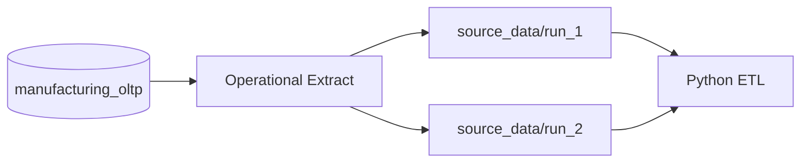
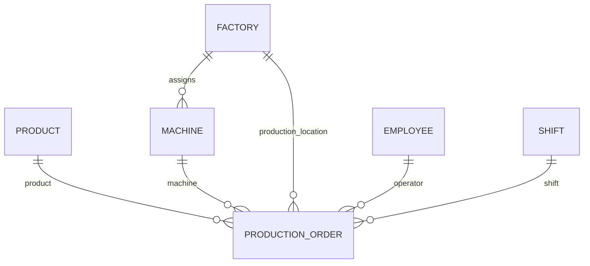
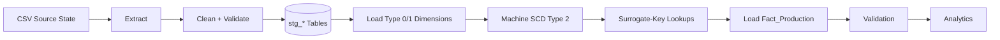
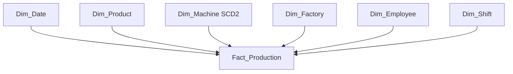
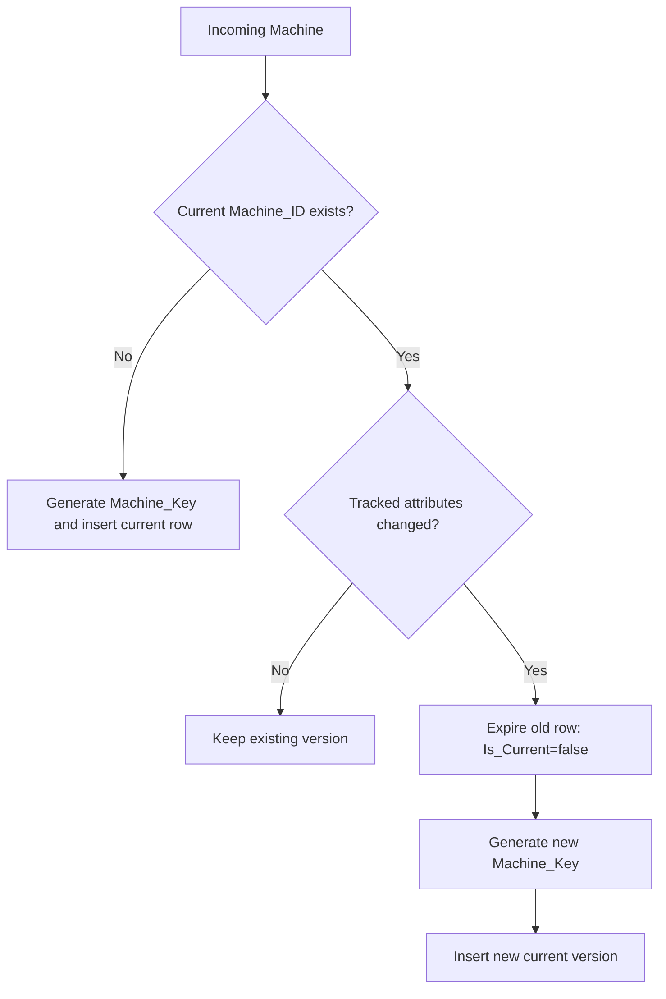
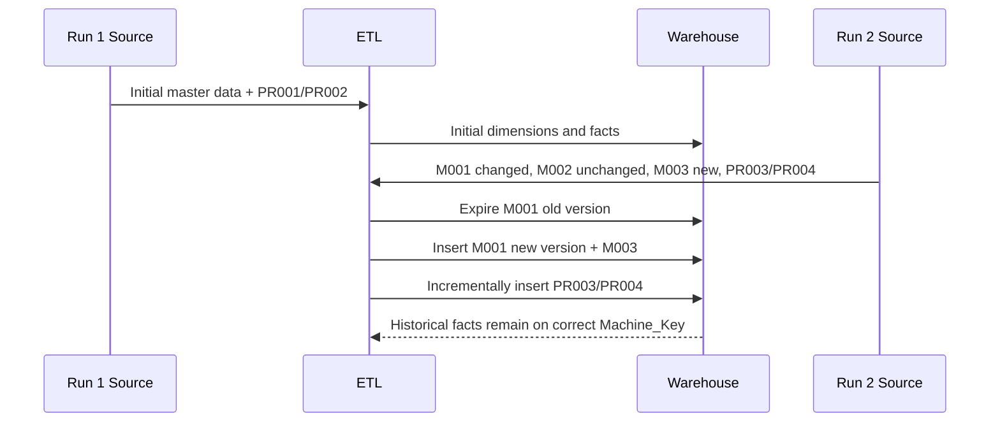
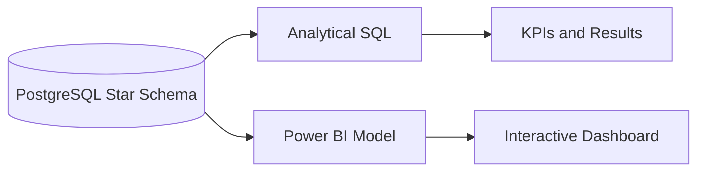

# Architecture Documentation

## 1. Source Architecture



The PostgreSQL OLTP model defines the business source. Run 1 and Run 2 CSV directories are reproducible snapshots of the relevant operational entities for the assignment demonstration.

## 2. OLTP Schema



Detailed table attributes and keys are documented in `documentation/oltp_design.md`.

## 3. ETL Architecture



## 4. Staging Schema

The ETL materialises one staging table per source entity:

```text
stg_product
stg_factory
stg_machine
stg_employee
stg_shift
stg_production
```

Staging tables temporarily hold the cleaned source-state data before dimension and fact processing.

## 5. Data Warehouse Star Schema



`Fact_Production` contains one production event at the declared grain and uses warehouse dimension keys as foreign keys.

## 6. SCD Type 2 Process



## 7. Two-Run Data Flow



## 8. Analytics / Reporting Architecture



The repository contains analytical SQL and a Power BI implementation specification. The final `.pbix` and screenshots are produced during the final visual-evidence stage.
